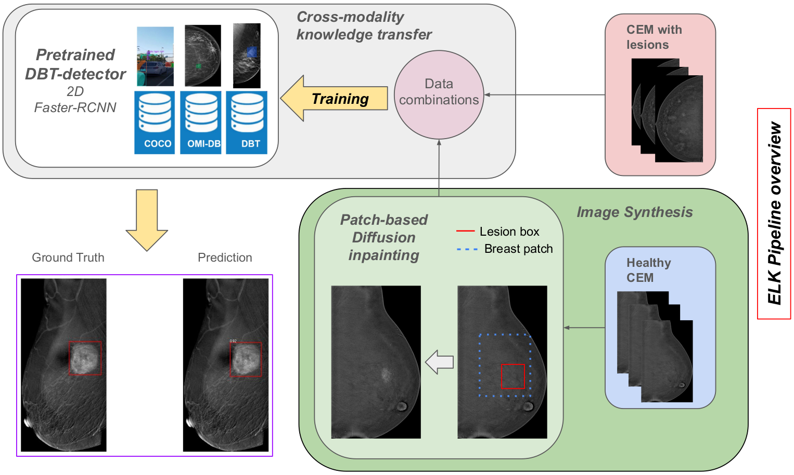

# ELK: Enhanced Learning through cross-modal Knowledge transfer for lesion detection in limited-sample contrast-enhanced mammography datasets

This is the official PyTorch implementation of the Deep-Brea<sup>3</sup>th-MICCAI 2024 workshop paper 
["ELK: Enhanced Learning through cross-modal Knowledge transfer for lesion detection in limited-sample contrast-enhanced mammography datasets"](https://link.springer.com/chapter/10.1007/978-3-031-77789-9_22).

## Abstract
Contrast-enhanced mammography (CEM) offers improved breast cancer diagnosis by enhancing vascular contrast uptake. However, the development of reliable deep learning-based computer-aided detection (CAD) systems for CEM is hindered by limited data availability. This paper introduces ELK (Enhanced Learning through cross-modal Knowledge transfer), a deep learning pipeline designed to adapt large pre-trained models into a target limited data-volume population by leveraging synthetic data augmentation. Specifically, we adapt a detection model pretrained on digital breast tomosynthesis (DBT) and digital mammography data into a target CEM population using diffusion models to generate high-resolution, realistic synthetic lesions, preserving the visual integrity of CEM images. To assess the efficacy of our synthetic lesions, we compare the detection performance of a pretrained Faster R-CNN detector fine-tuned using only real images, synthetic images, and a combination of both. Our approach improves mean sensitivity by 4% on a test sample from the same population and by 7% on a newly collected out-of-domain CEM dataset.



## Repository structure
```
.
├── README.md
├── data
│   ├── CDD-CESM
│   │   ├── images
│   │   ├── masks
│   │   ├── masks_closeup
│   │   └── metadata
│   ├── models
│   │   ├── config_trained_R_101_30k.yaml
│   │   └── model_final_R_101_omidb_30k_dbt9k_f12_gray.pth
│   └── SET-Mex (Private dataset)
│       ├── binary_masks
│       ├── images
│       └── metadata
├── data_analysis
├── detection
├── envs
├── generation
├── utils.py

```
## Environment setup

The pipeline can be divided in two sections: image generation and lesion detection.
- For image generation, check the [requirements_generation.txt](envs/requirements_generation.txt) file.
- For lesion detection, check the [requirements_detection.txt](envs/requirements_detection.txt) file.


## Data

The CDD-CESM dataset is publicly available and further information can be found in [this link](https://www.cancerimagingarchive.net/collection/cdd-cesm/). The SET-Mex dataset is a private dataset and is not publicly available.

## Synthetic data
The synthetic data used in this work can be found in the Hugging Face dataset repository [here](https://huggingface.co/datasets/Likalto4/CEM_synthetic_data).

## Citation

Considering citing this work if you find it useful:

```
@InProceedings{10.1007/978-3-031-77789-9_22,
author="Montoya-del-Angel, Ricardo
and Elbatel, Marawan
and Castillo-Lopez, Jorge Patricio
and Villase{\~{n}}or-Navarro, Yolanda
and Brandan, Maria-Ester
and Marti, Robert",
editor="Mann, Ritse M.
and Zhang, Tianyu
and Tan, Tao
and Han, Luyi
and Truhn, Danial
and Li, Shuo
and Gao, Yuan
and Doyle, Shannon
and Mart{\'i} Marly, Robert
and Kather, Jakob Nikolas
and Pinker-Domenig, Katja
and Wu, Shandong
and Litjens, Geert",
title="ELK: Enhanced Learning Through Cross-Modal Knowledge Transfer for Lesion Detection in Limited-Sample Contrast-Enhanced Mammography Datasets",
booktitle="Artificial Intelligence and Imaging for Diagnostic and Treatment Challenges in Breast Care",
year="2025",
publisher="Springer Nature Switzerland",
address="Cham",
pages="221--231",
isbn="978-3-031-77789-9"
}
```